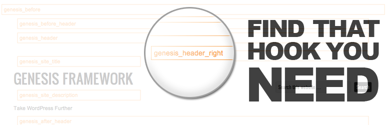
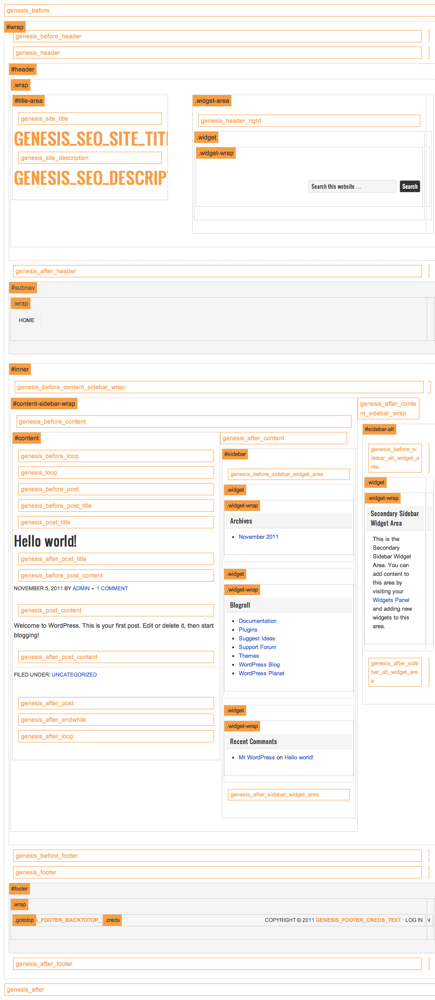
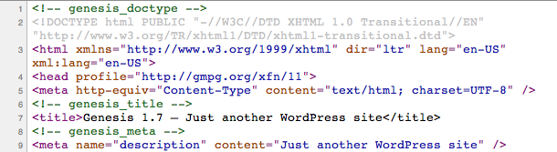

# Genesis Visual Hook Guide

Find Genesis hooks (action and filter hooks) quick and easily by seeing their actual locations inside your theme.

## Description 

Once a tool for myself the Genesis Visual Hook guide has slowly evolved into what it is today. I finally welcome the plugin version of the popular [Visual Genesis Hooks and Filters Guide](http://genesistutorials.com/visual-hook-guide) from [Genesis Tutorials](http://genesistutorials.com).

Once installed this plugin adds a drop down menu to the admin bar to select between three views (Hook, Filter, and Markup). Select an option or all three to see the hooks in their actual locations on your current theme.

Great companion to [Genesis Simple Hooks](https://wordpress.org/plugins/genesis-simple-hooks/).

**Genesis Theme Framework required.**

## Screenshots

  
_Screenshot 1: Markup using Custom Menu widget. Note the `aside`, `section` and `div` parents to `nav`._

---

  
_Screenshot 2: Markup using this plugin. `nav` is a sibling element to the title area `div`._

## Installation

### Upload

1. Download the latest tagged archive (choose the "zip" option).
* Go to the __Plugins__ → __Add New__ screen and click the __Upload__ tab.
* Upload the zipped archive directly.
* Go to the Plugins screen and click __Activate__.

### Manual

1. Download the latest tagged archive (choose the "zip" option).
* Unzip the archive.
* Copy the folder to your `/wp-content/plugins/` directory.
* Go to the Plugins screen and click __Activate__.

Check out the Codex for more information about [installing plugins manually](https://codex.wordpress.org/Managing_Plugins#Manual_Plugin_Installation).

### Git

In a terminal, browse to your `/wp-content/plugins/` directory and clone this repository:

~~~sh
git clone git@github.com:christophercochran/Genesis-Visual-Hook-Guide.git
~~~

Then go to your Plugins screen and click __Activate__.

## FAQ
### I have my admin bar disable, can I still view the hooks without it?

Sure! The views are triggered by a query string. Simply add ?g_markup=show ?g_hooks=show or ?g_filters=show to the end the url.

## Change Log

See the [change log](CHANGELOG.md).

## Credits

Built by [Christopher Cochran](https://twitter.com/tweetsfromchris)  
